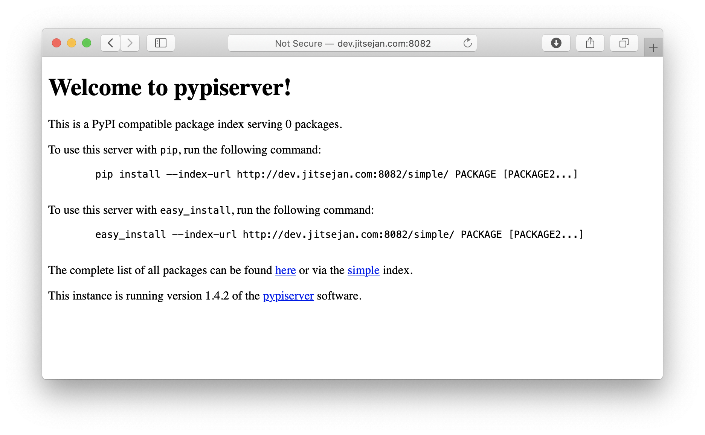
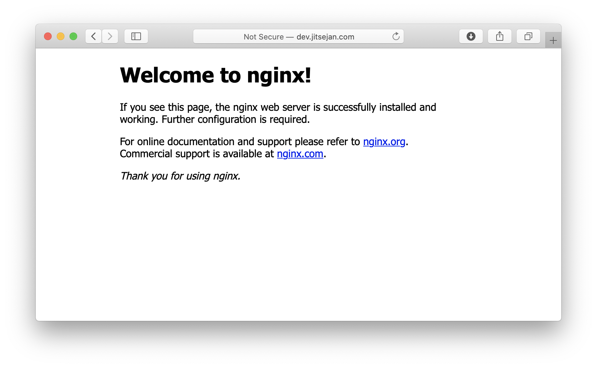
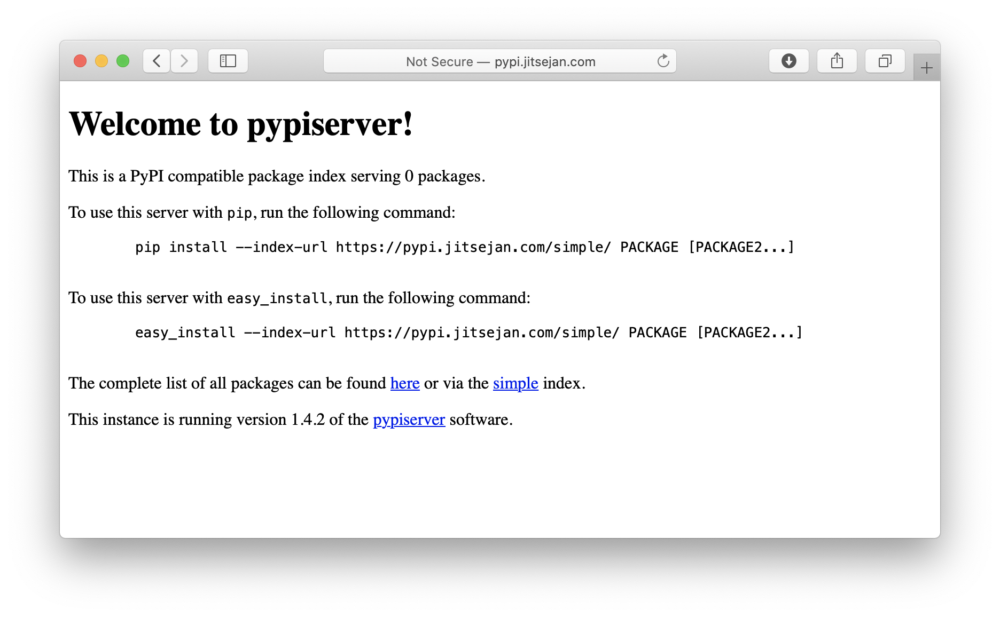
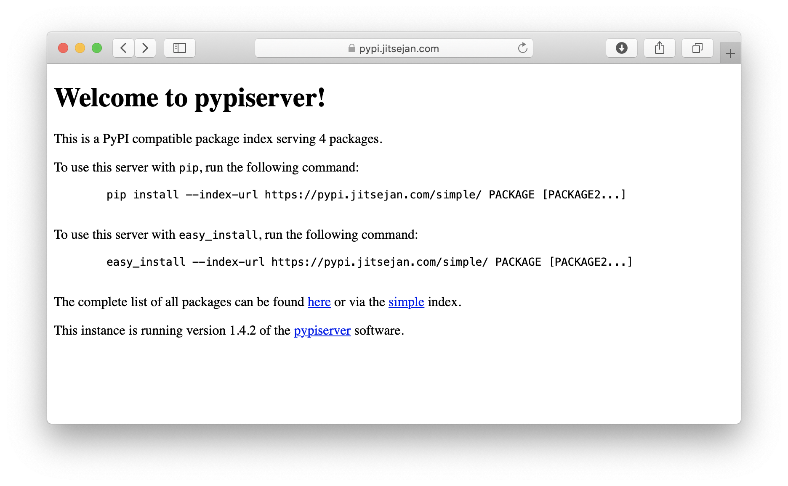
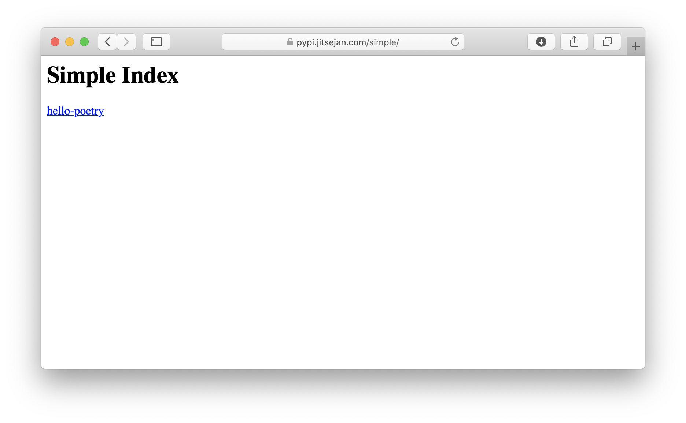

# Hello Poetry!

> Publishing your Python package to your own server

It has been quite a few years that I have been working with Python but I never took the time to take a deeper look into how to package my code. To be fair, I never really had the use case and the following tutorial is purely a simple introduction on how to create your package and deploy it to your private server. I have used the **complex** way of packaging as described on [python.org](https://packaging.python.org/tutorials/packaging-projects/#packaging-python-projects) in a different project (maybe another article?) and found it to be pretty tedious so I looked for a different method. A popular way of creating and deploying packages is by using [poetry](https://python-poetry.org) that can take care of your virtual environments and has a built-in mechanism to publish your packages to [PyPI](https://pypi.org).

## Prerequisites

- **Pyenv** - for managing Python versions.
  *Note: I am aware that `pyenv` also supports [virtual environments](https://github.com/pyenv/pyenv-virtualenv) but I prefer Poetry to manage them.* 
- **Poetry** - for virtual environments and packaging.

### Pyenv

First of all, I make sure I have [pyenv](https://github.com/pyenv/pyenv) installed on my server to manage the Python versions. Since I am on Ubuntu I use the [pyenv-installer](https://github.com/pyenv/pyenv-installer) as suggested in the docs.

```bash
jitsejan@theviji:~$ curl https://pyenv.run | bash
```

Update the `~/.zshrc` to enable `pyenv`:

```bash
jitsejan@theviji:~$ echo 'export PYENV_ROOT="$HOME/.pyenv"' >> ~/.zshrc                                                                                       jitsejan@theviji:~$ echo 'export PATH="$PYENV_ROOT/bin:$PATH"' >> ~/.zshrc
jitsejan@theviji:~$ echo -e 'if command -v pyenv 1>/dev/null 2>&1; then\n  eval "$(pyenv init -)"\nfi' >> ~/.zshrc                                                   
```

Reload the `~/.zshrc` and verify the version of `pyenv`.

```bash
jitsejan@theviji:~$ source ~/.zshrc
jitsejan@theviji:~$ pyenv --version
pyenv 1.2.23
```

Because of Linux [build problems](https://github.com/pyenv/pyenv/wiki/common-build-problems) I had to install the following packages to make `pyenv` work.

```
jitsejan@theviji:~$ sudo apt-get install -y build-essential libssl-dev zlib1g-dev libbz2-dev \
libreadline-dev libsqlite3-dev wget curl llvm libncurses5-dev libncursesw5-dev \
xz-utils tk-dev libffi-dev liblzma-dev python-openssl git
```

Finally, I'll install the [latest Python version](https://www.python.org/downloads/) which is 3.9.2. at the time of writing and make it the default Python version so it will be used automatically in a virtual environment.

```bash
jitsejan@theviji:~$ pyenv install 3.9.2
jitsejan@theviji:~$ pyenv versions
* system (set by /home/jitsejan/.pyenv/version)
  3.9.2
jitsejan@theviji:~$ pyenv global 3.9.2
jitsejan@theviji:~$ pyenv versions
  system
* 3.9.2 (set by /home/jitsejan/.pyenv/version)
```

### Poetry

Install Poetry for managing virtual environments and packaging the Python repositories.

```bash
jitsejan@theviji:~$ curl -sSL https://raw.githubusercontent.com/python-poetry/poetry/master/get-poetry.py | python -jitsejan@theviji:~$ source $HOME/.poetry/env
jitsejan@theviji:~$ poetry --version
Poetry version 1.1.5
```

And for shell completion the following command. I am using Linux with ZSH on my VPS so I use the right syntax according to their [docs](https://python-poetry.org/docs/#enable-tab-completion-for-bash-fish-or-zsh).

```bash
jitsejan@theviji:~$ poetry completions zsh > $ZSH_CUSTOM/plugins/poetry/_poetry
```

## Setup PyPi server

### Setup the repository

Create the folder and initialize a Poetry package inside of it. I am using Python 3.9 and fill in the rest of the metadata.

```bash
jitsejan@theviji:~$ mkdir ~/python-packages
jitsejan@theviji:~$ cd $_
jitsejan@theviji:~/python-packages$ poetry init

This command will guide you through creating your pyproject.toml config.

...
jitsejan@theviji:~/python-packages$ cat pyproject.toml
[tool.poetry]
name = "python-packages"
version = "0.1.0"
description = "This project contains my Python packages."
authors = ["Jitse-Jan"]
license = "BSD"

[tool.poetry.dependencies]
python = "^3.9"

[tool.poetry.dev-dependencies]

[build-system]
requires = ["poetry-core>=1.0.0"]
build-backend = "poetry.core.masonry.api"
```

### Installation

To host the Python packages I will be using [pypiserver](https://pypi.org/project/pypiserver/) which is one of the recommended and easy ways to host your own PyPI server. For this project I will be using 1.4.2. It supports different backends but I will simply use the VPS on my storage to host the packages.

```bash
jitsejan@theviji:~/python-packages$ poetry add pypiserver
Creating virtualenv python-packages-nJx9lSAW-py3.9 in /home/jitsejan/.cache/pypoetry/virtualenvs
Using version ^1.4.2 for pypiserver

Updating dependencies
Resolving dependencies... (0.2s)

Writing lock file

Package operations: 1 install, 0 updates, 0 removals

  • Installing pypiserver (1.4.2)
```

### Running

```
jitsejan@theviji:~/python-packages$ poetry shell
Spawning shell within /home/jitsejan/.cache/pypoetry/virtualenvs/python-packages-nJx9lSAW-py3.9
. /home/jitsejan/.cache/pypoetry/virtualenvs/python-packages-nJx9lSAW-py3.9/bin/activate
jitsejan@theviji:~/python-packages$ . /home/jitsejan/.cache/pypoetry/virtualenvs/python-packages-nJx9lSAW-py3.9/bin/activate
(python-packages-nJx9lSAW-py3.9) jitsejan@theviji:~/python-packages$ pypi-server -p 8082 .
```




### Security

```
~/python-packages ❯ poetry add passlib
~/python-packages ❯ sudo apt install apache2-utils
~/python-packages ❯ htpasswd -sc .htaccess pyjitsejan
New password:
Re-type new password:
Adding password for user pyjitsejan
~/python-packages ❯ cd ..
~ ❯ sudo apt install nginx   
```



```
~ ❯ sudo touch /etc/nginx/sites-available/pypi.jitsejan.com
```

```
upstream pypi {
  server 127.0.0.1:8082 fail_timeout=0;
}
server {
  listen 80;
  server_name pypi.jitsejan.com;
  location / {
    proxy_set_header Host $host;
    proxy_set_header X-Real-IP $remote_addr;
    proxy_set_header X-Forwarded-Proto https;
    proxy_set_header X-Forwarded-For $proxy_add_x_forwarded_for;
    add_header Pragma "no-cache";
    proxy_pass http://pypi;
  }
}
```

Enable

```
~ ❯ sudo ln -s /etc/nginx/sites-available/pypi.jitsejan.com /etc/nginx/sites-enabled
~ ❯ sudo service nginx restart
~/python-packages ❯  pypi-server -i 127.0.0.1 -p 8082 -P .htaccess --overwrite .
```




## SSL

```
~ ❯ sudo apt-get install certbot
~ ❯ sudo apt-get install python3-certbot-nginx
~ ❯ sudo certbot --nginx -d pypi.jitsejan.com
```




Enable automatic refresh of the SSL certificate by adding a rule to your crontab:

```
~ ❯ crontab -e
```

and add the following:

```
0 12 * * * /usr/bin/certbot renew --quiet
```


---


## Basic package

Using Poetry I will create a simple package to try this out.

```bash
jitsejan@theviji:~/code $ poetry new hello-poetry
Created package hello_poetry in hello-poetry
jitsejan@theviji:~/code $ cd hello-poetry/
jitsejan@theviji:~/code/hello-poetry $ tree .
.
├── hello_poetry
│   └── __init__.py
├── pyproject.toml
├── README.rst
└── tests
    ├── __init__.py
    └── test_hello_poetry.py

2 directories, 5 files
```


```bash
~/code/hello-poetry master ❯ poetry config repositories.dev http://pypi.jitsejan.com
~/code/hello-poetry master ❯ poetry publish -r dev                                                            No suitable keyring backends were found
Using a plaintext file to store and retrieve credentials
Username: pyjitsejan
Password:
Publishing hello-poetry (0.1.0) to dev
 - Uploading hello-poetry-0.1.0.tar.gz 100%
 - Uploading hello_poetry-0.1.0-py3-none-any.whl 100%
```



To avoid the need to type the username and password every time I want to push my package I set them through the `poetry config`.

```bash
~/code/hello-poetry master ❯ poetry config http-basic.dev pyjitsejan Sup3rS3cr3t£
```

## Bump version

As an additional test of packaging I will add a simple class to `hello_poetry/hellopoetry.py` inside my `hello-poetry` project. It does nothing more than printing **Hello Poetry** once it gets instantiated. 

```python
class HelloPoetry:

    def __init__(self):
        print("Hello Poetry")
```

The structure of the repository now looks like this:

```
jitsejan@theviji:~/code/hello-poetry $ tree .
├── hello_poetry
│   ├── hellopoetry.py
│   └── __init__.py
├── poetry.lock
├── pyproject.toml
├── README.md
└── tests
    ├── __init__.py
    └── test_hello_poetry.py
```

Using `poetry version` I bump the package version to **0.2.0** which will update the `pyproject.toml` file. With the new version in place I rerun the build step which will print it is adding the distribution for the new version. Finally, this new package gets published to the private PyPi server.

```bash
~/code/hello-poetry master ❯ poetry version 0.2.0 
Bumping version from 0.1.0 to 0.2.0
~/code/hello-poetry master ⇡1 ❯ poetry build                                                                      Building hello-poetry (0.2.0)
  - Building sdist
  - Built hello-poetry-0.2.0.tar.gz
  - Building wheel
  - Built hello_poetry-0.2.0-py3-none-any.whl
~/code/hello-poetry master ⇡1 ?2 ❯ poetry publish -r dev                                                          Publishing hello-poetry (0.2.0) to dev
 - Uploading hello-poetry-0.2.0.tar.gz 100%
 - Uploading hello_poetry-0.2.0-py3-none-any.whl 100%
```


## Installation

### Option 1 - Install using pip

#### Option 1.1 - Specifying the argument via the CLI

```bash
❯ pip install --extra-index-url http://pypi.jitsejan.com/simple --trusted-host pypi.jitsejan.com hello-poetry
```

#### Option 1.2 - Set the PypPi configuration

Add the following to `~/.config/pip/pip.conf`.

```ini
[global]
timeout = 60
extra-index-url = https://pypi.jitsejan.com/simple
```

Now `pip` will look at the normal index as well as the custom index:

```bash
❯ pip install hello-poetry
Looking in indexes: https://pypi.org/simple, https://pypi.jitsejan.com/simple
...
Installing collected packages: hello-poetry
Successfully installed hello-poetry-0.2.0
```

### Option 2 - Install using poetry

Assuming you are already in a `poetry` repository/environment you only need to add the extra source (`[[tool.poetry.source]]`)to the project configuration `pyproject.toml`:

```toml
[tool.poetry]
name = "testpypi"
version = "0.1.0"
description = ""
authors = ["Jitse-Jan <code@jitsejan.com>"]

[tool.poetry.dependencies]
python = "^3.9"

[tool.poetry.dev-dependencies]

[[tool.poetry.source]]
name = "pyjitsejan"
url = "https://pypi.jitsejan.com/simple/"

[build-system]
requires = ["poetry-core>=1.0.0"]
build-backend = "poetry.core.masonry.api"
```

Now that the extra index is added installation of my package will succeed and add it to the project dependencies.

```bash
❯ poetry add hello-poetry
Using version ^0.2.0 for hello-poetry

Updating dependencies
Resolving dependencies... (4.1s)

Writing lock file

Package operations: 6 installs, 0 updates, 0 removals

  • Installing certifi (2020.12.5)
  • Installing chardet (4.0.0)
  • Installing idna (2.10)
  • Installing urllib3 (1.26.4)
  • Installing requests (2.25.1)
  • Installing hello-poetry (0.2.0)
```

Checking the `pyproject.toml` I can confirm it is now expecting at least version 0.2.0. 

```toml
[tool.poetry.dependencies]
python = "^3.9"
hello-poetry = "^0.2.0"
```

## Usage

After installing the package through one of the above mentioned methods, or your own fancy way, it is time to check if the package is actually working. I have a simple `test.py` file that will import the class and create an instance. This should print **Hello Poetry** if all is correct.

```python
# test.py
from hello_poetry.hellopoetry import HelloPoetry

h = HelloPoetry()
```

Running this outputs the expected output!

```
❯ python test.py
Hello Poetry
```

Note that I could probably do better with naming the folders given that inside my `hello-poetry` repository I have the `hello_poetry` folder containing the `hellopoetry.py` file with the `HelloPoetry` class. 


## Sources

https://pypi.org/project/pypiserver/
https://pip.pypa.io/en/stable/user_guide/
https://medium.com/@christianhettlage/setting-up-a-pypi-server-679f1b55b96
https://medium.com/lambda-automotive/python-poetry-finally-easy-build-and-deploy-packages-e1e84c23401f
https://www.nginx.com/blog/using-free-ssltls-certificates-from-lets-encrypt-with-nginx/
https://github.com/python-poetry/poetry
https://github.com/pyenv/pyenv
https://github.com/pyenv/pyenv-installer